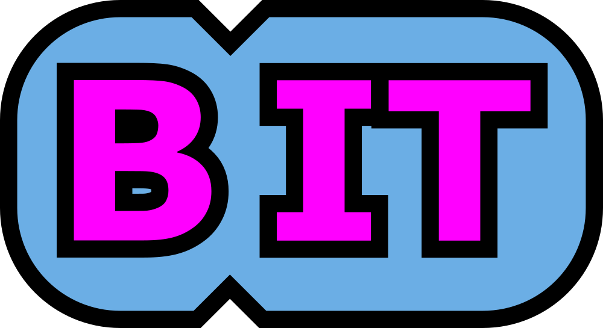

 

 

###

<h1 align="left">BUDEX IT - TECHNIK INFORMATYK ALE BAZA  Dążąc do totalnej dominacji maszyn nad rasą ludzką musimy podjąć kilka nieprzyjemnych decyzji. Jedną z nich jest szkolenie gatunku ludzkiego jarzmienia bestii ze stali.</h1>

###

###

###

###

 

<h2 align="left">Budex IT gwarantuje ŚWIETNE wyniki w egzaminach zawodowych i mnóstwo DOBREJ zabawy.  Uczyć będziecie się łączenia umysłów lepszych w grupy za pomocą sieci komputerowych! Dowiecie się jak działa matka, znaczy serwer! Będziecie mogli nadawać im myśli! Programowanie odbywa się według schematów których NIE WOLNO opuszczać.  Miłej przygody!</h2>

###

  
  

###
